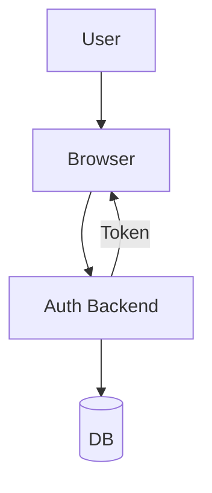

# Mermaid Diagrams

## See also

- `gjdutils/docs/instructions/GENERATE_MERMAID_DIAGRAM.md`
- `gjdutils/src/ts/cli/sequential-datetime-prefix.ts`
- `MERMAID_EXAMPLE.md`
- https://github.com/mermaid-js/mermaid-cli
- https://docs.anthropic.com/en/api
- `sharptools/markdown-to-html.ts` — convert Markdown (with `mermaid` fences) → HTML
- `sharptools/generate-mermaid-diagram.ts` — generate `.mermaid` from prompt and render `.svg`

## Paths and naming

- Sources: `docs/diagrams/*.mermaid`
- Outputs: `docs/diagrams/*.svg`
- Name: `yyMMdd[a-z]_slug.mermaid`
- Next prefix:

```bash
npx tsx gjdutils/src/ts/cli/sequential-datetime-prefix.ts docs/diagrams/
```

## Generate (manual)

```bash
npx mmdc -i docs/diagrams/FILENAME.mermaid -o docs/diagrams/FILENAME.svg \
  -w 1400 -H 1600 -s 2 -b transparent -t default
open docs/diagrams/FILENAME.svg
```

## Generate (LLM, optional)

- `ANTHROPIC_API_KEY` in `.env.local`
- Save Mermaid with standard name; add prompt as leading `%%` comment
- Render with `mmdc`, review

## Content rules

- Short labels; avoid quotes/parentheses
- Collapse long linear flows to one node with bullets
- Consistent colors/shapes; domain notation where relevant

## Checklist

- [ ] Named `yyMMdd[a-z]_slug` under `docs/diagrams/`
- [ ] `.svg` regenerated after `.mermaid` changes
- [ ] Labels concise; linear flows collapsed
- [ ] Prompt saved as leading comment

## Troubleshooting

- `mmdc` needs Chromium/Chrome
- Validate in Mermaid Live Editor if layout is off
- Split very large diagrams

## Example header



