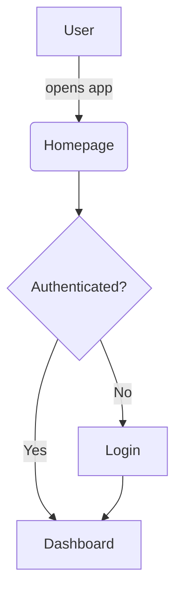

## Mermaid Diagram Example

This file demonstrates a simple Mermaid flowchart.

Notes:
- GitHub and many docs tools render Mermaid diagrams automatically.
- You can preview and tweak this diagram in the Mermaid Live Editor (`https://mermaid.live`).
